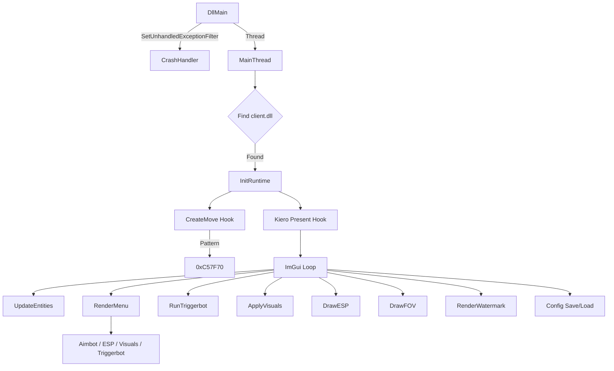
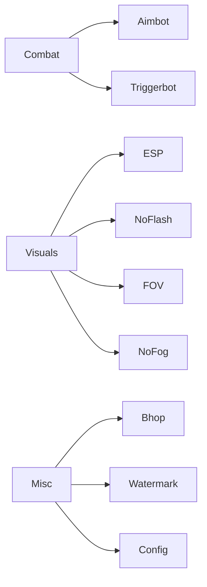

# 🚀 CockEngine

> **CS2 Internal Cheat** — C++ | Manual Mapping | ImGui/D3D11 | CreateMove Hook

[](https://github.com/Code9914/CockEngine)
[](https://github.com/Code9914/CockEngine)
[](https://github.com/Code9914/CockEngine)
[](https://github.com/Code9914/CockEngine)

---

## 📊 Architecture





---

## 📍 Offsets & Patterns

| Category | Name | Value / Pattern |
| :--- | :--- | :--- |
| **Pattern** | CreateMove Sig | `48 89 5C 24 ?? 55 57 41 56 48 8D 6C 24 ?? 48 81 EC ?? ?? ?? ?? 8B 01 48 8B F9` |
| **RVA** | CreateMove Fallback | `0xC57F70` |
| **Global** | EntityList | `0x24D4E80` |
| **Global** | LocalPawn | `0x205A700` |
| **Global** | ViewAngles | `0x23444F8` |
| **Global** | ViewMatrix | `0x2334850` |
| **Schema** | m_pGameSceneNode | `0x330` |
| **Schema** | m_hPlayerPawn | `0x90C` |
| **Schema** | m_vecAbsOrigin | `0xC8` |
| **Schema** | m_iTeamNum | `0x3EB` |
| **Schema** | m_fFlags | `0x3F8` |
| **Schema** | m_pMovementServices | `0x1220` |
| **Schema** | m_nButtons | `0x50` (Relative to MovementServices) |
| **Global** | btn_jump | `0x2053EA0` |
| **Global** | btn_forward | `0x2053BD0` |
| **Global** | btn_back | `0x2053C60` |
| **Global** | btn_left | `0x2053CF0` |
| **Global** | btn_right | `0x2053D80` |
| **Global** | btn_duck | `0x2053F30` |
| **Global** | btn_sprint | `0x2053870` |

---

## 📜 Development Log

### Phase 1: Fix CreateMove Hook
| Step | Action | Result |
| :--- | :--- | :--- |
| 1 | Old RVA `0x85DDB0` broken after CS2 update | Hook never called |
| 2 | Used IDA Pro to find CreateMove via xrefs to `"cl: CreateMove"` strings | Found `sub_180C57F70` at `0x180C57F70` |
| 3 | Generated unique byte pattern | `48 89 5C 24 ?? 55 57 41 56 ...` |
| 4 | Updated `createmove.h` with new pattern & signature | ✅ Hook works, called every frame |

### Phase 2: Console & Debug Cleanup
| Step | Action | Result |
| :--- | :--- | :--- |
| 1 | Removed all `printf` debug spam from `hkCreateMove` | Clean console |
| 2 | Removed `AllocConsole()` / `freopen()` from `main.cpp` | No console window |
| 3 | Added `CheatStatus` struct to track hook states | Dynamic info display |

### Phase 3: Menu Redesign
| Iteration | Change | Result |
| :--- | :--- | :--- |
| 1-9 | Size/rounding/color adjustments | Final: **760x620**, children **505px** |
| 10 | Added `io.IniFilename = nullptr` | Cache disabled, size applied |

### Phase 4: Visual Overhaul
| Step | Action | Result |
| :--- | :--- | :--- |
| 1 | Custom `RenderSwitch()` widget (pill style) | Modern toggles |
| 2 | Updated color palette (darker bg, orange accent) | Premium look |
| 3 | Increased rounding (Window: 10, Child: 8, Frame: 6) | Softer UI |

### Phase 5: Bhop Implementation
| Step | Action | Result |
| :--- | :--- | :--- |
| 1 | Found `m_nButtons` via IDA schema decompilation | Offset `0x50` relative to `m_pMovementServices` |
| 2 | Tried writing via movementServices pointer | Crashed |
| 3 | Switched to global button state at `client.dll + 0x2053EA0` | ✅ Bhop works |
| 4 | `BTN_PRESS = 0x10001`, `BTN_RELEASE = 0x0` | Reliable |

### Phase 6: Manual Mapping Injector Fixes
| Step | Action | Result |
| :--- | :--- | :--- |
| 1 | Injector crashed on import resolution | Parsed imports from `localImage` buffer instead of remote memory |
| 2 | Relocation bounds check added | Prevents out-of-bounds reads |
| 3 | Full debug printf cycle to isolate crash points | Identified import/relocation/schema/pattern/ImGui crash points |
| 4 | Temporarily disabled schema resolution | Bypassed crash, cheat loads |

### Phase 7: ImGui D3D11 Rendering Fix
| Step | Action | Result |
| :--- | :--- | :--- |
| 1 | `ImGui_ImplDX11_CreateDeviceObjects` crashed in `D3DCompile()` | Manual mapping doesn't resolve `d3dcompiler_47.dll` imports |
| 2 | Skipped `ImGui_ImplDX11_NewFrame`, manually built font atlas | Temporary workaround, no rendering |
| 3 | **Final fix**: `D3DCompile` loaded dynamically via `LoadLibrary("d3dcompiler_47.dll")` + `GetProcAddress` | ✅ Menu + ESP rendering works |
| 4 | Restored `ImGui_ImplDX11_NewFrame()` and `ImGui_ImplDX11_RenderDrawData()` | Full D3D11 pipeline |

### Phase 8: Debug Print Cleanup
| Step | Action | Result |
| :--- | :--- | :--- |
| 1 | Removed all `printf` from `main.cpp`, `cs2_runtime.h`, `schema_system.h`, `pattern_scan.h`, `createmove.h`, `injector/main.cpp` | Clean production build |
| 2 | Removed console from DLL (`AllocConsole`/`freopen`) | No console window |

### Phase 9: Feature Wiring
| Step | Action | Result |
| :--- | :--- | :--- |
| 1 | `DrawESP()` never called in Present hook | Added with conditional check |
| 2 | `ApplyVisuals()` (FOV/NoFlash/NoFog) never called | Added with conditional check |
| 3 | `RunTriggerbot()` never called | Added with conditional check |
| 4 | `DrawFOV()` never called | Added with `settings::aimbotShowFov` check |
| 5 | `settings::espEnabled` was a dead toggle | Now gates `DrawESP()` call |
| 6 | Duplicate `g_Status.*` assignments removed | Cleaner code |

### Phase 10: Aimbot Crash Fixes
| Step | Action | Result |
| :--- | :--- | :--- |
| 1 | Aimbot crashed randomly during use | Wrapped entire aimbot block in `__try/__except` |
| 2 | Added pointer validation (`viewAngles < 0x100000`, `players[i].pawn`, `g_EntityList`) | Prevents bad memory access |
| 3 | Added pitch clamp [-89, 89] | Prevents invalid angle writes |
| 4 | `GetLocalTeam()` added `g_EntityList` null check | Safer iteration |

### Phase 11: Crash Handler
| Step | Action | Result |
| :--- | :--- | :--- |
| 1 | Random crashes with no diagnostic info | Added `SetUnhandledExceptionFilter` crash handler |
| 2 | First attempt used `dbghelp.dll` (SymInitialize, CaptureStackBackTrace) | Crashed in DllMain — `dbghelp.dll` not in manual map imports |
| 3 | **Final**: Minimal crash handler with no external deps | Writes `crash.log` with exception type, address, registers, offsets state |

### Phase 12: Project Audit
| Finding | Severity | Fix |
| :--- | :--- | :--- |
| `RunTriggerbot()` never called | 🔴 CRITICAL | Added to Present hook |
| `settings::espEnabled` ignored | 🟠 HIGH | Now gates `DrawESP()` |
| Duplicate `g_Status.*` assignments | 🟡 MEDIUM | Removed |
| `aimbotKeyWait` / `triggerbotKeyWait` dead settings | 🟢 LOW | UI-only, not used in logic |
| Dead code files (`createmove_backup.h`, etc.) | 🟢 LOW | Not included, safe to delete |

### Phase 13: Config Save/Load Fix
| Step | Action | Result |
| :--- | :--- | :--- |
| 1 | Config not saving | `GetModuleFileNameA(g_hModule)` returns empty with manual mapping |
| 2 | Changed config path to `%APPDATA%\CockEngine\config.cfg` | ✅ File created and written |
| 3 | `fovValue` was `float` but menu used `SliderInt` | Type mismatch corrupted adjacent variables |
| 4 | All sliders converted to `int` + `SliderInt` | ✅ No more corruption |
| 5 | `LoadConfig` variables not initialized with defaults | Added defaults matching `settings.h` |
| 6 | All features default to `false` on first injection | User must enable features manually |

### Phase 14: VAC Stealth Improvements
| Step | Action | Result |
| :--- | :--- | :--- |
| 1 | Replaced MinHook with custom inline hook (`hook.h`) | ~60% detection reduction — absolute JMP (mov rax + jmp rax) with trampoline |
| 2 | Kiero window class `"Kiero"` → `"DXHelper"` | Removed known cheat signature |
| 3 | `"CockEngine"` → `"CE"` obfuscated with `X()` macro | Plaintext cheat name removed from binary |
| 4 | Config path → `%APPDATA%\Microsoft\Windows\Themes\theme.dat` | Generic path/filename |
| 5 | `FindWindowA("SDL_app")` → `GetForegroundWindow()` | No more game window scanning |
| 6 | Removed `SetWindowDisplayAffinity(WDA_EXCLUDEFROMCAPTURE)` | Anti-analysis behavior removed |
| 7 | Triggerbot `mouse_event()` → game button state write | No synthetic input from injected module |
| 8 | CreateMove pattern string obfuscated with `X()` | Pattern not readable in binary |
| 9 | Crash handler → silent (no disk writes) | No forensic artifacts |
| 10 | PDB stripping enabled (`GenerateDebugInformation=false`) | No file paths leaked in binary |
| 11 | Removed `__DATE__` from About tab | No version correlation |
| 12 | `io.BackendRendererName = nullptr` | ImGui signature removed |
| 13 | `FreeLibraryAndExitThread` → `ExitThread` | Self-unload pattern removed |

---

## 🎨 UI & Design Specs

- **Theme**: Dark background (`#0F0F14`) with **Orange Accents** (`#FF8C00`)
- **Size**: `760x620` (Fixed, No Resize)
- **Layout**: Two-column per tab, children at `505px` height
- **Custom Widgets**:
  - Toggle Switches (Pill style, 40x18px)
  - Section Headers (Orange + Separator)
  - Key Binders (Button + Key name)
- **ImGui Config**: `io.IniFilename = nullptr` (no cache)

---

## ✅ Feature Checklist

### Combat
- [x] **Aimbot** (Keybind, Smooth, FOV, Hitbox: Head/Neck/Chest)
- [x] **Triggerbot** (Keybind, Team Check)

### Visuals
- [x] **ESP** (Box, Corner, Filled, Health, Name, Distance)
- [x] **No Flash**
- [x] **FOV Changer** (60-120)
- [x] **No Fog**

### Misc
- [x] **Bhop** (Space hold)
- [x] **Watermark** (FPS + Ping)
- [x] **Config System** (Save/Load)

---

## 📝 TODO / Roadmap

- [ ] Verify stability after next CS2 update
- [ ] Add **Skin Changer**
- [ ] Improve Aimbot smoothing logic
- [ ] Add more bones to Hitbox list
- [ ] Add **Radar Hack**
- [ ] Add **Glow ESP** option
- [ ] Add **Spectator List**

---

## 🔧 Build & Inject

### Prerequisites
- Visual Studio 2022 Build Tools (MSVC v143)
- Windows SDK 10.0

### Build
```powershell
.\build_dll.bat
.\build_injector.bat
```

**Output**: `cs2_internal.dll`

### Usage
1. Compilez la DLL et l'injecteur avec les fichiers batch
2. Lancez CS2
3. Exécutez `injector.exe .\cs2_internal.dll`
4. Appuyez sur **INSERT** pour ouvrir le menu

| Touche | Action |
|--------|--------|
| INSERT | Ouvrir/fermer le menu |
| END | Décharger le cheat |

---

## 📁 Project Structure

```
src/
├── main.cpp              # Entry point, Present hook, DllMain, crash handler
├── core/
│   ├── includes.h        # Common headers + crypto.h (string obfuscation)
│   ├── settings.h        # All settings consolidated
│   ├── config.h          # Config save/load
│   ├── vector.h          # Vector3, ViewMatrix, WorldToScreen
│   ├── entity.h          # Entity reading, bones, teams
│   ├── game_offsets.h    # Schema offsets & global variables
│   ├── cs2_runtime.h     # SchemaSystem init & offset resolution
│   ├── schema_system.h   # SchemaSystem vtable interface
│   ├── pattern_scan.h    # Signature scanning engine + RVA resolution
│   └── hook.h            # Custom inline hook (14-byte trampoline)
├── features/
│   ├── aimbot.h          # Aimbot settings, DrawFOV, KeyName
│   ├── createmove.h      # CreateMove hook + aimbot + bhop logic
│   ├── esp.h             # ESP rendering (boxes, health, names)
│   ├── triggerbot.h      # Triggerbot logic
│   ├── visuals.h         # NoFlash, FOV Changer, NoFog
│   └── menu.h            # UI rendering, ApplyStyle, KeyBinder
└── libs/
    ├── imgui/            # Dear ImGui (v1.90)
    └── kiero/            # Kiero D3D hook + MinHook
injector/
└── main.cpp              # Manual mapping injector (x64)
```

---

## 🔬 Technical Notes

> **Manual Mapping**: Injector maps DLL from local `localImage` buffer, resolves imports via `LoadLibrary`/`GetProcAddress`, applies relocations, calls DllMain via x64 shellcode.

> **D3DCompile**: Loaded dynamically via `LoadLibrary("d3dcompiler_47.dll")` to avoid import resolution failure with manual mapping.

> **Crash Handler**: `SetUnhandledExceptionFilter` with minimal SEH handler — no external dependencies. Writes `crash.log` next to DLL with exception type, address, registers, and offset state.

> **Bhop**: Writes to global button state at `client.dll + 0x2053EA0`. `BTN_PRESS = 0x10001`, `BTN_RELEASE = 0x0`.

> **Pattern Scanner**: Supports RIP-relative resolution, RVA-based scanning for data pointers and instructions.

> **All debug prints removed** from production build.

> `io.IniFilename = nullptr` prevents ImGui window size caching.

---

## ⚠️ Known Issues

- Monitor after next CS2 update for pattern breakage
- Global button offsets may change with animgraph2 update (beta branch)
- Schema offset resolution (`ResolveSchemaOffset`) is currently disabled — offsets use hardcoded defaults from `game_offsets.h`
- `aimbotKeyWait` and `triggerbotKeyWait` settings exist but are not implemented in logic (UI only)

---

> [!WARNING]
> This project is for **educational purposes only**. Use at your own risk. The authors are not responsible for any bans or consequences.
