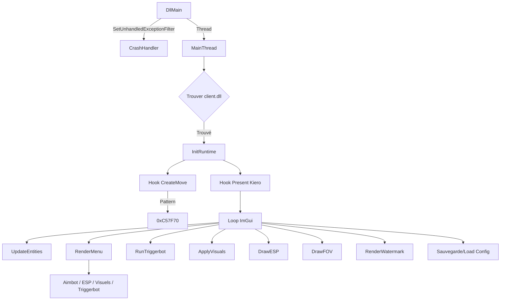
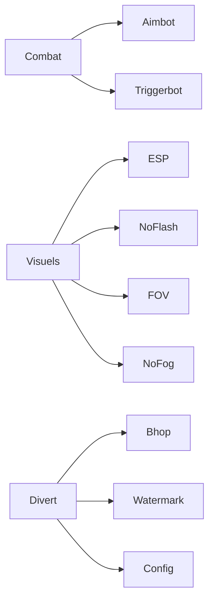

# 🚀 CockEngine

> **Cheat Interne CS2** — C++ | Manual Mapping | ImGui/D3D11 | Hook CreateMove

[](https://github.com/Code9914/CockEngine)
[](https://github.com/Code9914/CockEngine)
[](https://github.com/Code9914/CockEngine)
[](https://github.com/Code9914/CockEngine)

---

## 📊 Architecture





---

## 📍 Offsets & Patterns

| Catégorie | Nom | Valeur / Pattern |
| :--- | :--- | :--- |
| **Pattern** | Sig CreateMove | `48 89 5C 24 ?? 55 57 41 56 48 8D 6C 24 ?? 48 81 EC ?? ?? ?? ?? 8B 01 48 8B F9` |
| **RVA** | Fallback CreateMove | `0xC57F70` |
| **Global** | EntityList | `0x24D4E80` |
| **Global** | LocalPawn | `0x205A700` |
| **Global** | ViewAngles | `0x23444F8` |
| **Global** | ViewMatrix | `0x2334850` |
| **Schema** | m_pGameSceneNode | `0x330` |
| **Schema** | m_hPlayerPawn | `0x90C` |
| **Schema** | m_vecAbsOrigin | `0xC8` |
| **Schema** | m_iTeamNum | `0x3EB` |
| **Schema** | m_fFlags | `0x3F8` |
| **Schema** | m_pMovementServices | `0x1220` |
| **Schema** | m_nButtons | `0x50` (Relatif à MovementServices) |
| **Global** | btn_jump | `0x2053EA0` |
| **Global** | btn_forward | `0x2053BD0` |
| **Global** | btn_back | `0x2053C60` |
| **Global** | btn_left | `0x2053CF0` |
| **Global** | btn_right | `0x2053D80` |
| **Global** | btn_duck | `0x2053F30` |
| **Global** | btn_sprint | `0x2053870` |

---

## 📜 Journal de Développement

### Phase 1 : Correction du Hook CreateMove
| Étape | Action | Résultat |
| :--- | :--- | :--- |
| 1 | Ancien RVA `0x85DDB0` cassé après update CS2 | Hook jamais appelé |
| 2 | IDA Pro pour trouver CreateMove via xrefs vers `"cl: CreateMove"` | Trouvé `sub_180C57F70` à `0x180C57F70` |
| 3 | Génération d'un pattern bytes unique | `48 89 5C 24 ?? 55 57 41 56 ...` |
| 4 | Mise à jour de `createmove.h` avec le nouveau pattern | ✅ Hook fonctionne, appelé chaque frame |

### Phase 2 : Nettoyage Console & Debug
| Étape | Action | Résultat |
| :--- | :--- | :--- |
| 1 | Suppression de tous les `printf` de `hkCreateMove` | Console propre |
| 2 | Suppression de `AllocConsole()` / `freopen()` de `main.cpp` | Plus de fenêtre console |
| 3 | Ajout de la struct `CheatStatus` pour suivre les hooks | Affichage dynamique des états |

### Phase 3 : Redesign du Menu
| Itération | Changement | Résultat |
| :--- | :--- | :--- |
| 1-9 | Ajustements taille/arrondis/couleurs | Final : **760x620**, enfants **505px** |
| 10 | Ajout de `io.IniFilename = nullptr` | Cache désactivé, taille appliquée |

### Phase 4 : Refonte Visuelle
| Étape | Action | Résultat |
| :--- | :--- | :--- |
| 1 | Widget `RenderSwitch()` custom (style pillule) | Toggles modernes |
| 2 | Palette de couleurs mise à jour (fond sombre, accent orange) | Look premium |
| 3 | Arrondis augmentés (Fenêtre: 10, Enfant: 8, Frame: 6) | UI plus douce |

### Phase 5 : Implémentation Bhop
| Étape | Action | Résultat |
| :--- | :--- | :--- |
| 1 | Trouvé `m_nButtons` via décompilation IDA schema | Offset `0x50` relatif à `m_pMovementServices` |
| 2 | Écriture via pointeur movementServices | Crash |
| 3 | Passage au bouton global à `client.dll + 0x2053EA0` | ✅ Bhop fonctionne |
| 4 | `BTN_PRESS = 0x10001`, `BTN_RELEASE = 0x0` | Fiable |

### Phase 6 : Corrections Injecteur Manual Mapping
| Étape | Action | Résultat |
| :--- | :--- | :--- |
| 1 | Crash injecteur sur résolution des imports | Imports parsés depuis le buffer `localImage` au lieu de la mémoire distante |
| 2 | Vérification des limites de relocalisation ajoutée | Empêche les lectures hors limites |
| 3 | Cycle complet de printf debug pour isoler les crashes | Points de crash identifiés : import/relocation/schema/pattern/ImGui |
| 4 | Résolution schema temporairement désactivée | Crash évité, le cheat se charge |

### Phase 7 : Correction Rendu ImGui D3D11
| Étape | Action | Résultat |
| :--- | :--- | :--- |
| 1 | `ImGui_ImplDX11_CreateDeviceObjects` crash dans `D3DCompile()` | Manual mapping ne résout pas les imports `d3dcompiler_47.dll` |
| 2 | Skip de `ImGui_ImplDX11_NewFrame`, font atlas construit manuellement | Solution temporaire, pas de rendu |
| 3 | **Solution finale** : `D3DCompile` chargé dynamiquement via `LoadLibrary("d3dcompiler_47.dll")` + `GetProcAddress` | ✅ Menu + ESP fonctionnent |
| 4 | Restauration de `ImGui_ImplDX11_NewFrame()` et `ImGui_ImplDX11_RenderDrawData()` | Pipeline D3D11 complet |

### Phase 8 : Nettoyage des Prints Debug
| Étape | Action | Résultat |
| :--- | :--- | :--- |
| 1 | Suppression de tous les `printf` de `main.cpp`, `cs2_runtime.h`, `schema_system.h`, `pattern_scan.h`, `createmove.h`, `injector/main.cpp` | Build production propre |
| 2 | Console retirée de la DLL (`AllocConsole`/`freopen`) | Plus de fenêtre console |

### Phase 9 : Câblage des Fonctionnalités
| Étape | Action | Résultat |
| :--- | :--- | :--- |
| 1 | `DrawESP()` jamais appelé dans le hook Present | Ajout avec vérification conditionnelle |
| 2 | `ApplyVisuals()` (FOV/NoFlash/NoFog) jamais appelé | Ajout avec vérification conditionnelle |
| 3 | `RunTriggerbot()` jamais appelé | Ajout avec vérification conditionnelle |
| 4 | `DrawFOV()` jamais appelé | Ajout avec vérification `settings::aimbotShowFov` |
| 5 | `settings::espEnabled` était un toggle mort | Contrôle maintenant l'appel à `DrawESP()` |
| 6 | Assignations dupliquées `g_Status.*` supprimées | Code plus propre |

### Phase 10 : Corrections Crash Aimbot
| Étape | Action | Résultat |
| :--- | :--- | :--- |
| 1 | Aimbot crashait aléatoirement | Bloc aimbot entier dans `__try/__except` |
| 2 | Validation des pointeurs ajoutée (`viewAngles < 0x100000`, `players[i].pawn`, `g_EntityList`) | Empêche les accès mémoire invalides |
| 3 | Clamp du pitch [-89, 89] ajouté | Empêche les écritures d'angles invalides |
| 4 | `GetLocalTeam()` avec vérification null `g_EntityList` | Itération plus sûre |

### Phase 11 : Crash Handler
| Étape | Action | Résultat |
| :--- | :--- | :--- |
| 1 | Crashes aléatoires sans info de diagnostic | Ajout de `SetUnhandledExceptionFilter` crash handler |
| 2 | Première tentative avec `dbghelp.dll` (SymInitialize, CaptureStackBackTrace) | Crash dans DllMain — `dbghelp.dll` pas dans les imports manual map |
| 3 | **Final** : Crash handler minimal sans dépendances externes | Écrit `crash.log` avec type d'exception, adresse, registres, état des offsets |

### Phase 12 : Audit du Projet
| Constat | Sévérité | Correction |
| :--- | :--- | :--- |
| `RunTriggerbot()` jamais appelé | 🔴 CRITIQUE | Ajouté au hook Present |
| `settings::espEnabled` ignoré | 🟠 HAUTE | Contrôle maintenant `DrawESP()` |
| Assignations dupliquées `g_Status.*` | 🟡 MOYENNE | Supprimées |
| `aimbotKeyWait` / `triggerbotKeyWait` settings morts | 🟢 BASSE | UI uniquement, pas utilisés dans la logique |
| Fichiers de code mort (`createmove_backup.h`, etc.) | 🟢 BASSE | Non inclus, supprimables |

### Phase 13 : Correction Sauvegarde/Load Config
| Étape | Action | Résultat |
| :--- | :--- | :--- |
| 1 | Config ne se sauvegarde pas | `GetModuleFileNameA(g_hModule)` retourne vide avec manual mapping |
| 2 | Changement du chemin config vers `%APPDATA%\CockEngine\config.cfg` | ✅ Fichier créé et écrit |
| 3 | `fovValue` était `float` mais le menu utilisait `SliderInt` | Incompatibilité de type corrompait les variables adjacentes |
| 4 | Tous les sliders convertis en `int` + `SliderInt` | ✅ Plus de corruption |
| 5 | Variables `LoadConfig` non initialisées avec des valeurs par défaut | Valeurs par défaut ajoutées correspondant à `settings.h` |
| 6 | Toutes les fonctionnalités par défaut à `false` à la première injection | L'utilisateur doit activer manuellement |

### Phase 14 : Améliorations Furtivité VAC
| Étape | Action | Résultat |
| :--- | :--- | :--- |
| 1 | Remplacement de MinHook par hook inline custom (`hook.h`) | ~60% réduction détection — JMP absolu (mov rax + jmp rax) avec trampoline |
| 2 | Classe de fenêtre Kiero `"Kiero"` → `"DXHelper"` | Signature de cheat connue supprimée |
| 3 | `"CockEngine"` → `"CE"` obfusqué avec macro `X()` | Nom du cheat en clair retiré du binaire |
| 4 | Chemin config → `%APPDATA%\Microsoft\Windows\Themes\theme.dat` | Chemin/nom générique |
| 5 | `FindWindowA("SDL_app")` → `GetForegroundWindow()` | Plus de scan de fenêtre de jeu |
| 6 | Suppression de `SetWindowDisplayAffinity(WDA_EXCLUDEFROMCAPTURE)` | Comportement anti-analyse retiré |
| 7 | Triggerbot `mouse_event()` → écriture état bouton jeu | Plus d'input synthétique depuis le module injecté |
| 8 | Pattern CreateMove obfusqué avec `X()` | Pattern non lisible dans le binaire |
| 9 | Crash handler → silencieux (pas d'écriture disque) | Pas d'artefacts forensiques |
| 10 | Stripping PDB activé (`GenerateDebugInformation=false`) | Pas de chemins de fichiers dans le binaire |
| 11 | Suppression de `__DATE__` de l'onglet About | Pas de corrélation de version |
| 12 | `io.BackendRendererName = nullptr` | Signature ImGui supprimée |
| 13 | `FreeLibraryAndExitThread` → `ExitThread` | Pattern d'auto-déchargement supprimé |

### Phase 15 : Silent Aimbot (CCSGOInput)
| Étape | Action | Résultat |
| :--- | :--- | :--- |
| 1 | Tentative d'écriture dans `CUserCmd` (`a2+0x60`, `a2+0x64`) | Aucun effet sur la caméra |
| 2 | Analyse IDA Pro de `CreateMove` (`sub_180C57F70`) | Découverte que `a2` n'est pas le `CUserCmd` final |
| 3 | Analyse du wrapper `sub_180C3C500` | `a1` = `CCSGOInput*`, `a2` = structure intermédiaire |
| 4 | Debug printf pour scanner offsets `0x50-0x80` | Identification des deltas souris/angles |
| 5 | **Silent Aimbot implémenté** | Écriture dans `a1+0x10` (Pitch) et `a1+0x14` (Yaw) **avant** `oCreateMove` |
| 6 | Ajout setting `aimbotSilent` dans `settings.h` | Toggle Silent Aim ON/OFF |
| 7 | Fallback vers `ViewAngles` si Silent désactivé | Compatibilité avec l'ancien système |

### Phase 16 : Migration CUserCmd Test
| Étape | Action | Résultat |
| :--- | :--- | :--- |
| 1 | Copie du projet vers `D:\Projets\C++ CUserCmd Test` | Environnement de test isolé |
| 2 | Tentatives multiples d'écriture `CUserCmd` | Échecs (offsets incorrects dans cette version CS2) |
| 3 | Console activée pour debug | Printf des 5 premiers appels CreateMove |
| 4 | Scan offsets `0x50-0x80` dans `a1` et `a2` | En cours d'analyse |

### Phase 17 : Durcissement Sécurité Mémoire
| Étape | Action | Résultat |
| :--- | :--- | :--- |
| 1 | Audit de tous les accès mémoire (lecture/écriture) | Identification des points de crash potentiels |
| 2 | `entity.h` : validation `g_EntityList > 0x100000`, `controller/pawn > 0x100000` | Plus de crash sur entités invalides |
| 3 | `entity.h` : `players[i].name[0] = '\0'` au lieu de cast unsafe | Copy safe des noms |
| 4 | `triggerbot.h` : `__try/__except` global + validation `atkAddr` | Triggerbot ne crash plus |
| 5 | `visuals.h` : `__try/__except` global | NoFlash/FOV/NoFog sécurisés |
| 6 | `esp.h` : validation `viewMatrix > 0x100000`, `__try/__except` sur `DrawESP()` | ESP stable |
| 7 | `createmove.h` : validation `a1 > 0x100000` avant lecture/écriture Silent Aim | Fallback vers `oCreateMove` en cas d'exception |
| 8 | Synchronisation des 2 projets + push GitHub | Commit `6a681f8` sur `Code9914/CockEngine` |

---

## 🎨 Spécifications UI & Design

- **Thème** : Fond sombre (`#0F0F14`) avec **Accents Orange** (`#FF8C00`)
- **Taille** : `760x620` (Fixe, pas de redimensionnement)
- **Layout** : Deux colonnes par onglet, enfants à `505px` de hauteur
- **Widgets Custom** :
  - Toggles Switches (style pillule, 40x18px)
  - En-têtes de section (Orange + Séparateur)
  - Key Binders (Bouton + Nom de touche)
- **Config ImGui** : `io.IniFilename = nullptr` (pas de cache)

---

## ✅ Liste des Fonctionnalités

### Combat
- [x] **Aimbot** (Keybind, Smooth, FOV, Hitbox: Tête/Cou/Torse)
- [x] **Triggerbot** (Keybind, Vérification d'équipe)

### Visuels
- [x] **ESP** (Box, Coins, Rempli, Santé, Nom, Distance)
- [x] **No Flash**
- [x] **FOV Changer** (60-120)
- [x] **No Fog**

### Divert
- [x] **Bhop** (Maintenir espace)
- [x] **Watermark** (FPS + Ping)
- [x] **Système de Config** (Sauvegarde/Load)

---

## 🔧 Build & Injection

### Prérequis
- Visual Studio 2022 Build Tools (MSVC v143)
- Windows SDK 10.0

### Build
```powershell
.\build_dll.bat
.\build_injector.bat
```

**Sortie** : `cs2_internal.dll`

### Utilisation
1. Compilez la DLL et l'injecteur avec les fichiers batch
2. Lancez CS2
3. Exécutez `injector.exe .\cs2_internal.dll`
4. Appuyez sur **INSERT** pour ouvrir le menu

| Touche | Action |
|--------|--------|
| INSERT | Ouvrir/fermer le menu |
| END | Décharger le cheat |

---

## 📁 Structure du Projet

```
src/
├── main.cpp              # Point d'entrée, hook Present, DllMain, crash handler
├── core/
│   ├── includes.h        # Headers communs + crypto.h (obfuscation de strings)
│   ├── settings.h        # Tous les settings consolidés
│   ├── config.h          # Sauvegarde/load config
│   ├── vector.h          # Vector3, ViewMatrix, WorldToScreen
│   ├── entity.h          # Lecture entités, os, équipes
│   ├── game_offsets.h    # Offsets schema & variables globales
│   ├── cs2_runtime.h     # Init SchemaSystem & résolution offsets
│   ├── schema_system.h   # Interface vtable SchemaSystem
│   ├── pattern_scan.h    # Moteur de signature scanning + résolution RVA
│   └── hook.h            # Hook inline custom (trampoline 14 bytes)
├── features/
│   ├── aimbot.h          # Settings aimbot, DrawFOV, KeyName
│   ├── createmove.h      # Hook CreateMove + logique aimbot + bhop
│   ├── esp.h             # Rendu ESP (boîtes, santé, noms)
│   ├── triggerbot.h      # Logique triggerbot
│   ├── visuals.h         # NoFlash, FOV Changer, NoFog
│   └── menu.h            # Rendu UI, ApplyStyle, KeyBinder
└── libs/
    ├── imgui/            # Dear ImGui (v1.90)
    └── kiero/            # Kiero D3D hook + MinHook
injector/
└── main.cpp              # Injecteur manual mapping (x64)
```
